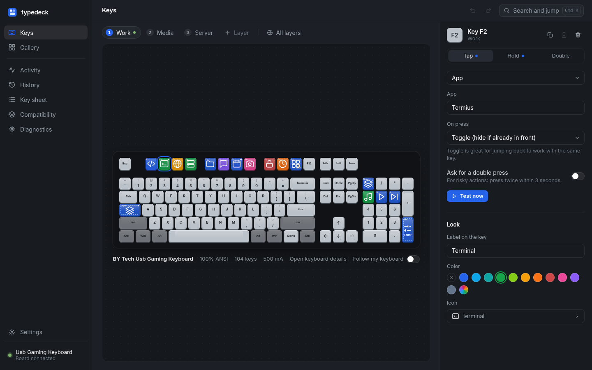
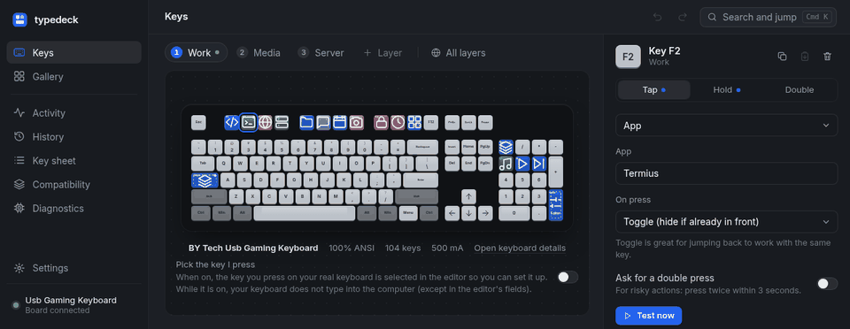
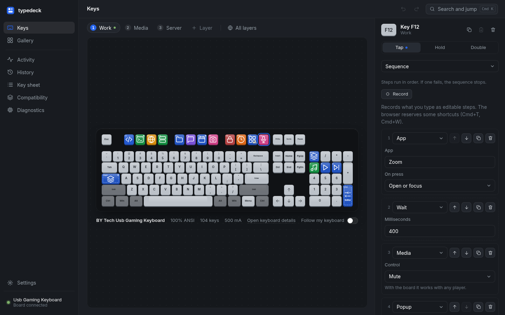
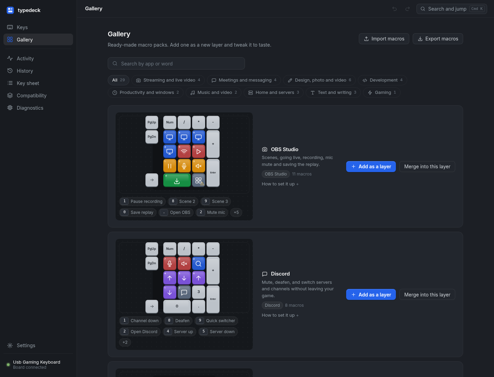
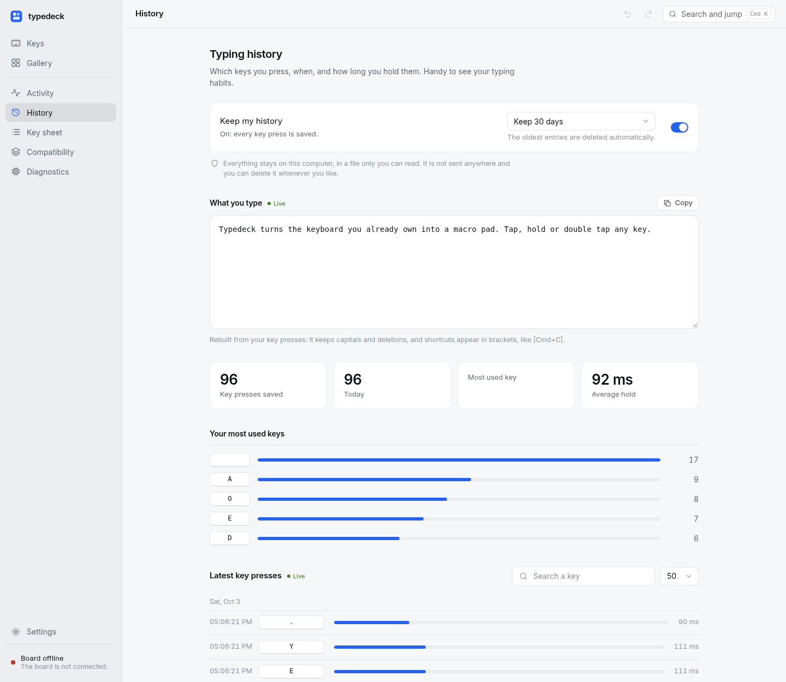
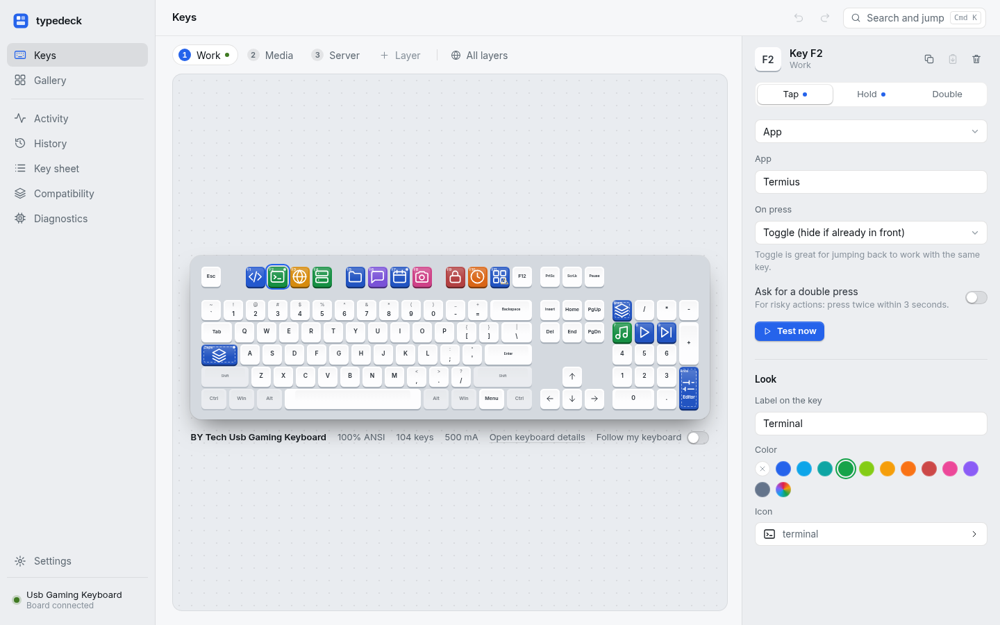
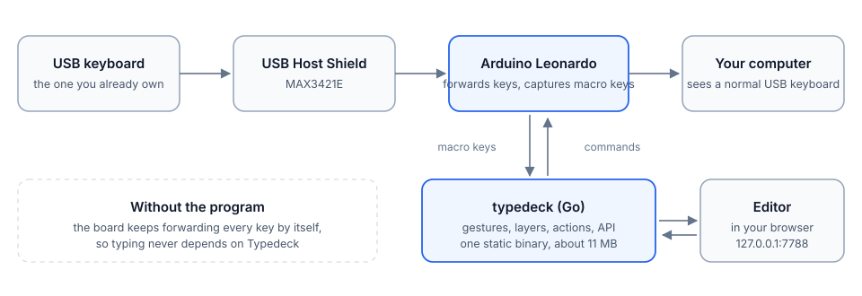

# Typedeck

[English](README.md) | Español

[](https://github.com/cristobaltormo/typedeck/actions/workflows/ci.yml)
[](https://github.com/cristobaltormo/typedeck/releases)
[](LICENSE)
[](go.mod)
[](docs/COMPATIBILITY.md)

Convierte el teclado USB que ya tienes en un teclado de macros. Una Arduino Leonardo pequeña con un USB Host Shield se coloca entre
el teclado y el ordenador, deja pasar todas las teclas sin tocarlas y permite que cualquiera ejecute sus propias acciones: pulsar,
mantener o doble pulsación, capas, lanzadores de aplicaciones, comandos, SSH, textos, teclas multimedia, OBS Studio y más.

Escribir nunca depende del programa. Si no está en marcha, o se cierra por un fallo, la placa sigue reenviando el teclado por su
cuenta y cada tecla escribe su carácter de siempre.

Typedeck es un único binario de Go sin dependencias. En reposo gasta unos 11 MB de RAM y nada de CPU, y reenviar una tecla tarda
unos 0,13 ms dentro de la placa. Funciona en macOS, Linux y Windows, y sus pruebas corren en los tres en cada subida.



Mueve un macro a otra tecla arrastrándolo; con Alt se copia en vez de mover.



## Cómo se ve

El editor se abre en el navegador, en tu propio ordenador. Elige una tecla en el dibujo de tu teclado real y dale una acción.

| | |
|---|---|
|  **Secuencias** con grabador, condiciones y pausas editables |  **Una galería** de paquetes colocados en las teclas que tu teclado tiene |
|  **Historial de tecleo**, opcional y local, con lo que escribes en directo |  **Claro y oscuro**, en inglés y español |

## Cómo funciona



La placa recoge el teclado del shield, reenvía sus informes al ordenador como un teclado USB normal y retira solo las teclas que
tienen macro, enviándolas al programa por una línea serie. El programa decide qué hace cada gesto. Un latido cada segundo mantiene la
captura; sin él, la placa deja de capturar a los 5 segundos. Más en [docs/ARCHITECTURE.md](docs/ARCHITECTURE.md) (en inglés).

## Qué necesitas

| Pieza | Notas |
|---|---|
| Arduino Leonardo (ATmega32U4) | probado con una Keystudio KS0248 |
| USB Host Shield 2.0 (MAX3421E) **con conector ICSP** | probado con uno de Yanmis |
| Un teclado USB con cable | hasta 500 mA |
| macOS 12 o posterior, Linux (X11 o Wayland) o Windows 10 y 11 | en [compatibilidad](docs/COMPATIBILITY.md) está qué se ha probado dónde |

Apila el shield sobre la Leonardo, enchufa el teclado al shield y la Leonardo al ordenador. Si hay un KVM o un hub por medio, lee
antes [docs/HARDWARE.md](docs/HARDWARE.md).

## Instalar

En Debian, Ubuntu y Fedora, descarga el `.deb` o el `.rpm` de tu arquitectura desde la
[página de versiones](https://github.com/cristobaltormo/typedeck/releases). Instala el programa, la regla udev que deja a tu usuario abrir
la placa y el sketch del firmware:

```sh
sudo apt install ./typedeck_<versión>_amd64.deb      # o: sudo dnf install ./typedeck-<versión>-1.x86_64.rpm
```

En cualquier otro sitio, descarga el archivo comprimido o el binario suelto de tu equipo de la misma página:

```sh
curl -L -o typedeck https://github.com/cristobaltormo/typedeck/releases/latest/download/typedeck-linux-amd64
chmod +x typedeck
```

En Windows, en PowerShell:

```powershell
Invoke-WebRequest https://github.com/cristobaltormo/typedeck/releases/latest/download/typedeck-windows-amd64.exe -OutFile typedeck.exe
```

Hay versiones para Linux (amd64, arm64), macOS (Intel y Apple silicon) y Windows (amd64 y arm64), cada una con su suma en
`SHA256SUMS` y una atestación de procedencia de la compilación (`gh attestation verify <archivo> --repo cristobaltormo/typedeck`). Para compilarlo tú necesitas Go 1.24 o posterior:

```sh
go install github.com/cristobaltormo/typedeck/cmd/typedeck@latest
```

Flashea la placa una vez. Cada versión adjunta el firmware ya compilado, `typedeck-firmware-<número>.hex`, y `arduino-cli` lo sube igual
en Windows, Linux y macOS:

```sh
arduino-cli core install arduino:avr
arduino-cli upload --fqbn arduino:avr:leonardo --port <puerto> --input-file typedeck-firmware-14.hex
```

Detén Typedeck antes y mira [docs/HARDWARE.md](docs/HARDWARE.md#flashing) para los nombres de puerto y los pasos. Para compilar el firmware
tú mismo hacen falta las dos librerías que usa ([firmware/README.md](firmware/README.md)).

## Ponerlo en marcha

```sh
typedeck doctor     # comprueba la configuración, las herramientas del sistema, el puerto, la placa y el teclado
typedeck            # arranca el programa; el editor está en http://127.0.0.1:7788
typedeck install    # arranca con tu sesión (typedeck uninstall lo quita)
```

- **macOS:** `make install` compila e instala un servicio de sesión y el cartel, y deja `Typedeck.app` en `~/Applications`.
- **Linux:** copia `packaging/linux/70-typedeck.rules` a `/etc/udev/rules.d/` para que tu usuario abra la placa sin estar en el grupo
  `dialout`. Instala `xdg-utils` y `libnotify-bin`; `xdotool` (X11) o `wtype` (Wayland) solo importan si la placa no está conectada.
  Registro: `journalctl --user -u typedeck`.
- **Windows:** `typedeck.exe install` crea una tarea programada que lo arranca al iniciar sesión. Windows 11 con el *Control
  inteligente de aplicaciones* activado bloquea los programas sin firmar; desactívalo (Seguridad de Windows, Control de aplicaciones
  y navegador) o compila el programa tú mismo.

Con `TYPEDECK_PORT=/dev/ttyACM1` (o `COM5`) indicas el puerto si la placa está en uno poco habitual. La primera pantalla del editor
te guía por el teclado que ha encontrado y su disposición.

## Qué puede hacer

- **Gestos y capas.** Pulsar, mantener y doble pulsación en cada tecla, cada uno con su acción. Hasta nueve capas con color, que se
  cambian con una tecla, de forma momentánea mientras se mantiene una tecla o solas cuando una aplicación pasa al frente.
- **Quince tipos de acción.** Aplicación (abrir, alternar, cerrar), enlace, comando, SSH, petición web, atajo, texto, secuencia,
  condición, multimedia, sistema, historial de tecleo, OBS Studio, temporizador, capa y cartel. La lista completa está en
  [docs/MACROS.md](docs/MACROS.md).
- **Graba y luego edita.** Teclea una secuencia y Typedeck la convierte en pasos, con tus pausas como pasos de espera que puedes
  ajustar, reordenar y duplicar.
- **Condiciones.** Ejecuta una lista de pasos u otra según la aplicación de delante, la capa activa, la hora, el sistema, si OBS
  está en directo o grabando, o lo que haya en el portapapeles.
- **Comparte macros en archivos.** Exporta una capa o todo; al importar se enseñan los comandos y peticiones web del archivo antes
  de añadir nada. En [examples/](examples) hay paquetes para empezar.
- **Una galería de 38 paquetes** para OBS Studio, Discord, Zoom, Meet, Teams, Slack, Photoshop, Figma, Premiere, VS Code, Git,
  domótica, estudio y más, colocados en las teclas que tu teclado tiene.
- **Todo tu teclado, no un pad aparte.** Detecta el teclado (marca, modelo, datos USB) y lo dibuja con su formato real, del 100 al
  60 por ciento, ISO o ANSI. Un asistente de teclas deduce la disposición cuando el teclado no la dice.
- **Sin permisos para teclear.** Atajos, texto y teclas multimedia salen como pulsaciones USB reales de la placa: sin permiso de
  Accesibilidad en macOS y sin `xdotool` en Linux. Se compensan los modificadores remapeados y las rarezas ISO/ANSI de un Mac, y el
  texto en español usa la disposición correcta y Alt Gr en cada sistema.
- **OBS Studio sin atajos.** Escenas, empezar el directo, grabar, silenciar el micro o guardar el replay por el propio servidor
  WebSocket de OBS.
- **Editor en directo.** Cada tecla se ilumina en el dibujo al pulsarla, un cartel avisa cuando la placa deja de ver el teclado y
  la tecla que abre el editor lleva a la pestaña que ya está abierta.
- **Historial de tecleo, opcional.** Desactivado por defecto. Una página con lo que escribes como texto, totales, tus teclas más
  usadas y las últimas pulsaciones, guardado en un archivo local, con lo más antiguo borrándose solo y un interruptor que puedes
  poner en una tecla. No sale de tu ordenador.
- **Y todo lo demás.** Página de compatibilidad con comprobaciones automáticas, registro de actividad y uso por tecla, hoja de teclas
  con buscador e imprimible, diagnóstico, paleta de comandos, deshacer y rehacer, copias automáticas.

## Seguro por diseño

- Las teclas solo se retiran del teclado mientras el programa está vivo. Si se para, todas vuelven a escribir en 5 segundos.
- El editor escucha solo en `127.0.0.1`, cada petición necesita una clave generada en cada arranque, y un archivo de macros que
  importes se valida y se te enseña antes de añadirlo. [docs/SECURITY.md](docs/SECURITY.md) tiene el modelo y [SECURITY.md](SECURITY.md)
  cómo avisar de un problema.
- Typedeck no hace ninguna conexión de red por su cuenta, no tiene telemetría y no carga nada de internet.
- Sin el historial de tecleo opcional, el programa solo ve las teclas que tienen macro.

## Rendimiento

| Qué | Resultado |
|---|---|
| Reenviar un informe del teclado dentro de la placa | unos 0,13 ms |
| Memoria del programa en reposo | unos 11 MB, 0 % de CPU |
| Primera carga del editor | unos 100 KB, sin framework |

Los detalles y cómo medir tu equipo están en [docs/PERFORMANCE.md](docs/PERFORMANCE.md).

## Documentación

La documentación técnica está en inglés: [macros](docs/MACROS.md), [preguntas frecuentes](docs/FAQ.md),
[compatibilidad](docs/COMPATIBILITY.md), [arquitectura](docs/ARCHITECTURE.md), [protocolo serie](docs/PROTOCOL.md),
[hardware y alimentación](docs/HARDWARE.md), [seguridad](docs/SECURITY.md), [rendimiento](docs/PERFORMANCE.md) y
[problemas frecuentes](docs/TROUBLESHOOTING.md).

## Límites

Seis teclas a la vez (protocolo de arranque, comprobado con el teclado real) y sin reenvío del ratón ni de las teclas de sistema
integradas del teclado. Detrás de un conmutador KVM el teclado puede dejar de verse tras un corte de corriente: el firmware lo
recupera solo en menos de un minuto, y [Hardware](docs/HARDWARE.md) explica cómo evitarlo alimentando la placa por separado.

## Contribuir

Un informe de error con la salida de `typedeck doctor` es lo más útil que puedes mandar; las pull requests son bienvenidas.
[CONTRIBUTING.md](CONTRIBUTING.md) tiene la preparación y las reglas, y todo se comprueba con `make check`.

## Privacidad

Typedeck no abre ninguna conexión de red por su cuenta ni envía datos a ningún sitio; el editor solo escucha en `127.0.0.1`.

## Licencia

El programa, el editor y la documentación son MIT, ver [LICENSE](LICENSE). El firmware de `firmware/` se compila con la librería USB
Host Shield 2.0 y por eso es GPL-2.0, ver [NOTICE](NOTICE).
